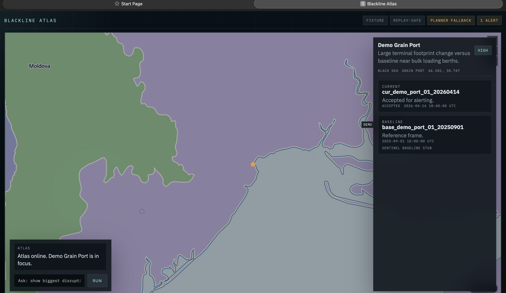
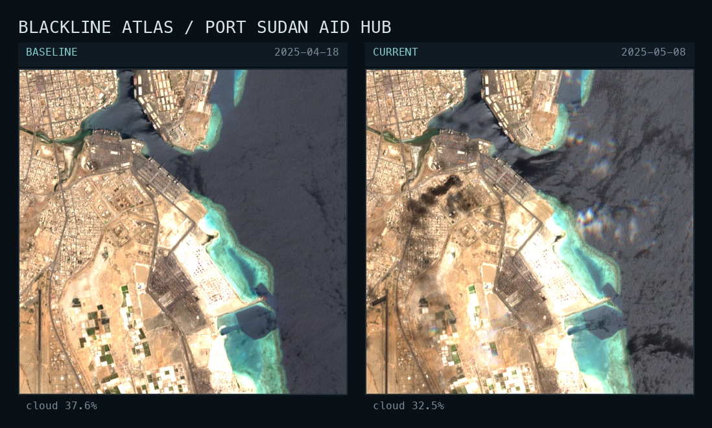

# Blackline Atlas

Blackline Atlas is a map-first civilian lifeline disruption triage system built during the Liquid AI x DPhi Space hackathon.

It compares current satellite imagery against historical baselines for a small, curated watchlist of public civilian lifelines, then emits structured alerts only when macro-scale visible disruption is defensible.

It now also carries a small file-backed lead registry for globe markers, separate from the exact-site watchlist and exact-site VLM review lane.

## What it does

- civilian lifeline monitoring, not general surveillance
- map-first operator workflow with an agent command dock
- globe lead markers with a compact source popup before full evidence review
- structured alert generation, not chatty summarization
- deterministic replay and cached fallback paths
- Sentinel-first time-aware change checks

## Scope

Blackline Atlas is intentionally narrow.

We prioritize:
- food infrastructure
- water infrastructure
- aid nodes
- a small set of clearly civilian mobility chokepoints

We do not aim to support:
- tactical targeting
- strike support
- military asset ranking
- tiny-object surveillance
- route or convoy intelligence

## Current status

Prototype, but real:

- backend product loop works end to end
- map-first UI and deterministic agent contract are live
- replay-safe and cached fallback paths are in place
- first `22`-row internal non-demo gold eval set is frozen
- fine-tuning is not the critical path yet

Current reality:
- internal annotated eval set exists and drives the core product
- external benchmark seeds exist for auxiliary transfer testing
- prompted baseline and benchmark runners exist
- no trustworthy train split yet
- the biggest bottleneck is now train-row acquisition and freeze discipline, not framework work

## Repo layout

```text
blackline-atlas/
├── app/                     backend routes, services, schemas
├── training/
│   ├── replay_pack/         internal eval rows, tranche plans, research notes
│   ├── external_benchmarks/ public benchmark seed slices
│   ├── internal_benchmarks/ tiny checked-in internal benchmark seeds
│   └── scripts/             capture, corpus build, eval, benchmark helpers
├── tests/                   API, runtime, eval, and UI regressions
├── ui/                      same-origin map-first shell and assets
└── docs/                    stable product and training docs
```

## Screens

Map-first shell:



Real analyzed case, Port Sudan Aid Hub before/after:



## Quick start

```bash
cp .env.example .env
python3 -m pip install -e ".[dev]"
make dev
```

Then open:
- API docs: `http://127.0.0.1:8000/docs`
- UI shell: `http://127.0.0.1:8000/ui`

Useful API surfaces:
- `GET /assets`
- `GET /leads`
- `POST /agent/query`

## Local data lane

Primary local data source:
- SimSat historical Sentinel: `http://localhost:9005/data/image/sentinel`
- SimSat current Sentinel: `http://localhost:9005/data/current/image/sentinel`

Bring-up:

```bash
git clone https://github.com/DPhi-Space/SimSat.git ~/Projects/oss/SimSat
cd ~/Projects/oss/SimSat
export MAPBOX_ACCESS_TOKEN=...
docker compose up -d
curl http://localhost:9005/
```

Freeze one capture pack:

```bash
python3 training/scripts/capture_simsat_manifest.py \
  --historical-endpoint http://localhost:9005/data/image/sentinel \
  --cases-dataset training/replay_pack/non_demo_eval.jsonl \
  --capture-overrides training/replay_pack/non_demo_capture_overrides.json \
  --output-dir /tmp/non_demo_simsat_capture
```

Build and score the prompted baseline corpus:

```bash
python3 training/scripts/build_lfm25_vl_corpus.py \
  --capture-manifest /tmp/non_demo_simsat_capture/simsat_capture_manifest.json \
  --replay-dataset training/replay_pack/non_demo_eval.jsonl \
  --output-dir /tmp/non_demo_corpus

python3 training/scripts/export_leap_vlm_sft.py \
  --candidate-eval-dataset /tmp/non_demo_corpus/blackline_candidate_eval.jsonl \
  --output-dir /tmp/non_demo_leap

python3 training/scripts/run_lfm25_vl_prompted_eval.py \
  --dataset /tmp/non_demo_corpus/blackline_candidate_eval.jsonl \
  --output-dir /tmp/non_demo_eval_run
```

Refresh the local lead registry seed:

```bash
python3 training/scripts/refresh_lead_registry.py \
  --source-path app/services/lead_sources.seed.json \
  --output-path app/services/lead_registry.seed.json
```

Notes:
- `app/services/lead_sources.seed.json` is the curated source-of-truth for globe leads
- `app/services/lead_registry.seed.json` is the refreshed runtime registry used by `/leads`

## Benchmarking

Ready benchmark slices:
- internal public research seed:
  - `training/internal_benchmarks/blackline_public_seed`
- external public seeds:
  - `training/external_benchmarks/xbd_public_seed`
  - `training/external_benchmarks/spacenet8_public_seed`

Run the first cohort:

```bash
python3 training/scripts/run_model_benchmark.py \
  --manifest training/replay_pack/model_benchmark_manifest.json \
  --slice-id internal_public_seed_v0 \
  --slice-id xbd_public_seed_v0 \
  --slice-id spacenet8_public_seed_v0
```

Important:
- external slices are auxiliary research slices
- they do not replace the internal Blackline gold set
- the full internal non-demo benchmark still needs frozen SimSat bytes or a capture manifest

## Train-prep

Current rule:

- keep the `22`-row non-demo gold eval set frozen
- export LEAP-compatible VLM SFT from the same frozen corpus shape
- start train acquisition in a separate tranche, not by mutating gold rows
- first promoted train rows now live in [training/replay_pack/train_01.jsonl](training/replay_pack/train_01.jsonl)
- current Train 01 count: `19`

Working doc:

- [training/replay_pack/train_tranche_01.md](training/replay_pack/train_tranche_01.md)

For heavier runs, prefer Hugging Face Jobs. See [docs/HF_JOBS.md](docs/HF_JOBS.md).

## Key docs

- [docs/BLUEPRINT.md](docs/BLUEPRINT.md)
- [docs/SPECS.md](docs/SPECS.md)
- [docs/TRAINING_BLUEPRINT.md](docs/TRAINING_BLUEPRINT.md)
- [docs/HF_JOBS.md](docs/HF_JOBS.md)

Most working research notes live under:
- [training/replay_pack/](training/replay_pack)

## What needs help

Best contributions now:
- more exact civilian lifeline eval cases
- more controls and false-positive traps
- stronger map readability and mobile polish
- better benchmark slices for transfer testing
- tooling for freezing and reviewing real Sentinel pairs
