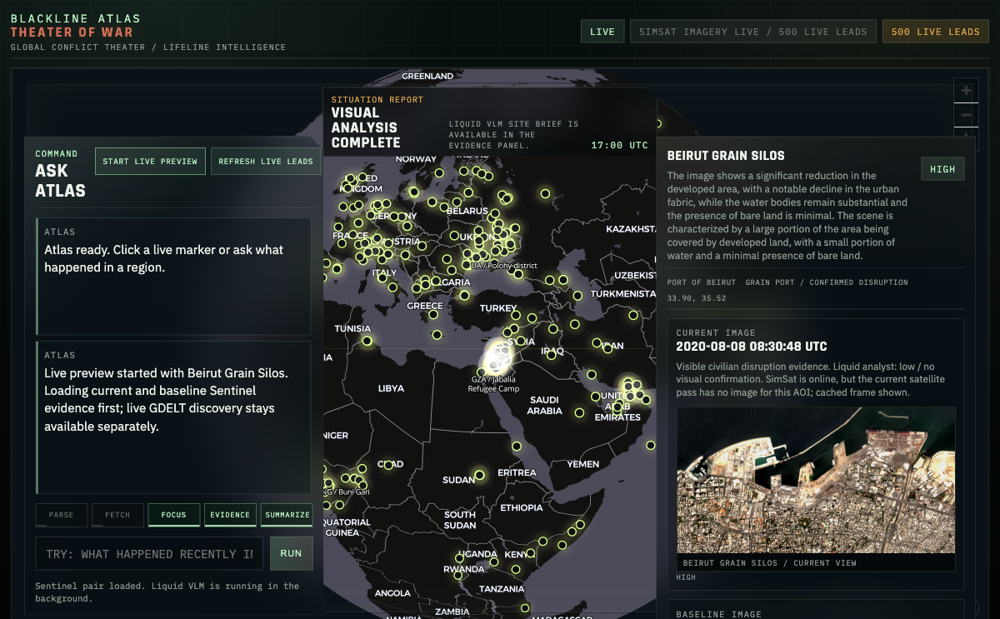

# Blackline Atlas

**Source-led satellite triage for civilian infrastructure disruption.**

Blackline Atlas turns public disruption reports into a bounded satellite review
workflow:

```text
public source lead
  -> selected coordinate
  -> Sentinel current/baseline imagery
  -> Liquid VLM visual site brief
  -> deterministic civilian-scope guardrails
```

The product separates source context from visual evidence. A news report can say
that a bridge, port, hospital, road, water station, or warehouse was damaged;
Blackline Atlas checks whether satellite imagery can support a cautious visual
site brief for that location.

## Screenshot



## What It Does

- Fetches and caches public disruption leads from GDELT.
- Shows geolocated source leads on a WebGL globe.
- Labels leads as source-only or inspectable.
- Retrieves current and baseline Sentinel imagery through SimSat.
- Runs a local Liquid planner for structured commands.
- Runs a local Liquid VLM analyst for paired-image visual briefs.
- Keeps final actions constrained to `discard`, `defer`, and `downlink_now`.
- Withholds visual claims when imagery or model output is not reliable.

Blackline Atlas is not a general chatbot. It is a structured alert component for
macro-scale civilian disruption review.

## Scope

In scope:

- lifeline infrastructure
- ports and logistics hubs
- bridges and road chokepoints
- hospitals and aid facilities
- water and power infrastructure
- macro-scale visible disruption

Out of scope:

- tactical targeting
- strike support
- troop or weapon tracking
- military asset ranking
- real-time surveillance claims
- sabotage guidance

## Quick Start

Use Python `3.11+`.

```bash
git clone https://github.com/ChrisRPL/blackline-atlas.git
cd blackline-atlas
cp .env.example .env
python3 -m pip install -e ".[dev]"
make dev
```

Open:

- UI: `http://127.0.0.1:8000/ui`
- API docs: `http://127.0.0.1:8000/docs`
- Health: `http://127.0.0.1:8000/health`
- Model status: `http://127.0.0.1:8000/model/status`

This app-only run starts the FastAPI backend and UI with configured local
fallback behavior. For live local models and live SimSat imagery, use the
runtime setup below.

## Full Local Runtime

The full local stack uses:

- FastAPI app on `127.0.0.1:8000`
- SimSat on `localhost:9005`
- Ollama OpenAI-compatible planner endpoint on `127.0.0.1:11434`
- Liquid VLM OpenAI-compatible analyst endpoint on `127.0.0.1:8014`

### 1. Start SimSat

```bash
git clone https://github.com/DPhi-Space/SimSat.git ~/Projects/oss/SimSat
cd ~/Projects/oss/SimSat
export MAPBOX_ACCESS_TOKEN=...
docker compose up -d
curl http://localhost:9005/
```

Blackline Atlas uses these SimSat endpoints:

- `/data/current/image/sentinel`
- `/data/image/sentinel`

Mapbox is used only for inspection context. Sentinel current/baseline imagery is
the evidence lane.

### 2. Start The Liquid Planner

Install and run Ollama, then pull the planner model:

```bash
ollama serve
```

In another terminal:

```bash
ollama pull hf.co/LiquidAI/LFM2.5-1.2B-Instruct-GGUF:latest
```

Required `.env` values:

```bash
AGENT_MODEL_VERSION=hf.co/LiquidAI/LFM2.5-1.2B-Instruct-GGUF:latest
AGENT_ENDPOINT=http://127.0.0.1:11434/v1/chat/completions
AGENT_HTTP_ENABLED=true
AGENT_PROVIDER=openai_chat_completions_http
AGENT_TIMEOUT_SECONDS=15
```

### 3. Start The Liquid VLM Analyst

```bash
python3 -m pip install -e ".[dev,vlm]"
python3 training/scripts/serve_liquid_vl_openai.py \
  --port 8014 \
  --backend transformers \
  --model-id LiquidAI/LFM2.5-VL-450M \
  --adapter-ref ChrisRPL/blackline-atlas-lfm25-vl-sft-hf-corpus-full-v1b-adapter
```

Required `.env` values:

```bash
ANALYST_MODEL_VERSION=LiquidAI/LFM2.5-VL-450M
ANALYST_ADAPTER_REF=ChrisRPL/blackline-atlas-lfm25-vl-sft-hf-corpus-full-v1b-adapter
ANALYST_ENDPOINT=http://127.0.0.1:8014/v1/chat/completions
ANALYST_HTTP_ENABLED=true
ANALYST_PROVIDER=openai_chat_completions_http
```

### 4. Start Blackline Atlas

```bash
cp .env.example .env
make dev
```

### 5. Run Preflight

```bash
make preflight
```

Expected result:

- `simsat_current`: `ready/live_http`
- `simsat_baseline`: `ready/live_http`
- `agent_backend`: `ready/live_http`
- `analyst_backend`: `ready/live_http`
- SAM disabled and outside runtime authority

Then open `http://127.0.0.1:8000/ui`.

## Runtime Behavior

The app is intentionally explicit about degraded dependencies.

- If SimSat is unreachable, `/health` reports `unreachable`.
- If the planner endpoint is disabled, `/health` reports `not_configured`.
- If the planner endpoint is configured but down, `/health` reports
  `unreachable`.
- If the analyst endpoint is disabled, the UI does not show a failed VLM card.
- If source-only leads have no defensible Sentinel pair, they stay source-only.
- If Liquid returns malformed or unsupported output, the visual brief is
  withheld.

`/health` distinguishes dependency mode:

- `live_http`
- `fixture_reference`
- `not_configured`
- `unreachable`

## Architecture

```text
ui/
  same-origin browser shell, globe, command panel, evidence tray

app/api/
  FastAPI routes for health, leads, frames, evidence, analyst, and agent query

app/schemas/
  Pydantic contracts for assets, frames, alerts, leads, health, and model output

app/services/
  lead registry, SimSat frame retrieval, planner, analyst, guardrails, replay

training/scripts/
  dataset builders, VLM serving bridge, eval scripts, training helpers

training/replay_pack/
  frozen eval rows and source-led visual evidence examples

tests/
  API, UI shell, planner, evidence, analyst, frame, and training regressions
```

Main request flow:

```text
operator query or marker click
  -> /agent/query
  -> structured tool selection
  -> live lead registry or selected site comparison
  -> SimSat current/baseline imagery
  -> Liquid VLM paired-image report
  -> schema validation and guardrails
  -> UI evidence tray and decision card
```

## Models And Data

Primary visual analyst:

- Base: [`LiquidAI/LFM2.5-VL-450M`](https://huggingface.co/LiquidAI/LFM2.5-VL-450M)
- Adapter: [`ChrisRPL/blackline-atlas-lfm25-vl-sft-hf-corpus-full-v1b-adapter`](https://huggingface.co/ChrisRPL/blackline-atlas-lfm25-vl-sft-hf-corpus-full-v1b-adapter)
- Corpus: [`ChrisRPL/blackline-atlas-training-corpus-v1`](https://huggingface.co/datasets/ChrisRPL/blackline-atlas-training-corpus-v1)
- Training job: [`69f66f889d85bec4d76f0be0`](https://huggingface.co/jobs/ChrisRPL/69f66f889d85bec4d76f0be0)

Training completed on `30,858` train rows and `3,421` eval rows. Eval loss
improved from `3.0021` to `0.3273`. On the corpus-native 22-case SimSat gold
eval, the adapter produced `22 / 22` valid JSON and `19 / 22` valid
analyst-schema reports. That supports guarded visual site briefs, not autonomous
alert authority.

SAM/SAM3 remains an experimental high-resolution evaluation lane. It is not part
of runtime authority for Sentinel-scale evidence.

## Live Lead Refresh

The UI `Refresh live leads` button calls `POST /leads/refresh`.

Source order:

1. GDELT Cloud when `GDELT_API_KEY` or `GDELT_CLOUD_API_KEY` is configured.
2. Public GDELT Project export files as fallback.
3. Existing cached leads if live refresh fails.

Manual cache refresh:

```bash
python3 -m app.services.lead_registry_refresh \
  --source-mode gdelt_cloud \
  --output-path var/live_leads.json \
  --gdelt-cloud-days 30 \
  --gdelt-cloud-limit 500 \
  --gdelt-cloud-confidence-profile loose \
  --gdelt-cloud-countries all
```

Set `LEAD_REGISTRY_PATH=var/live_leads.json` to make `/leads` and the planner
consume the refreshed cache. `var/` is ignored.

## Verification

Fast checks:

```bash
python3 -m ruff check app tests ui scripts
python3 -m compileall -q app scripts
node --check ui/shell.js
git diff --check
```

Full local gate:

```bash
python3 -m pytest -q
```

Focused API/UI checks:

```bash
python3 -m pytest tests/test_api.py tests/test_ui_shell.py -q
```

## Contributing

Good contributions improve one of these areas:

- runtime reliability
- evidence honesty
- typed API contracts
- source-to-image separation
- model-output validation
- UI clarity under degraded services
- tests for safety and regression behavior

Before opening a pull request:

```bash
python3 -m ruff check app tests ui scripts
python3 -m compileall -q app scripts
node --check ui/shell.js
python3 -m pytest -q
git diff --check
```

Contribution rules:

- Keep modules small and typed.
- Add regression tests for behavior changes when practical.
- Do not promote source reports into visual facts.
- Do not promote Mapbox/context imagery as evidence.
- Do not add tactical targeting, strike support, troop tracking, weapon
  tracking, military asset ranking, or sabotage guidance.
- Keep local artifacts, screen captures, caches, downloaded datasets, model weights,
  and scratch notes out of git.

## Repository Notes

Ignored local artifacts include:

- `work/`
- `var/`
- `.cache/`
- `.playwright-mcp/`
- `training/eval_runs/`
- `training/corpus/`
- model weight files
- generated DAG/graph artifacts

Useful docs:

- [Technical specs](docs/SPECS.md)
- [Dataset research notes](docs/DATASET_RESEARCH.md)
- [Training blueprint](docs/TRAINING_BLUEPRINT.md)
- [HF Jobs plan](docs/HF_JOBS.md)
- [SAM3 evidence notes](docs/SAM3_EVIDENCE.md)
